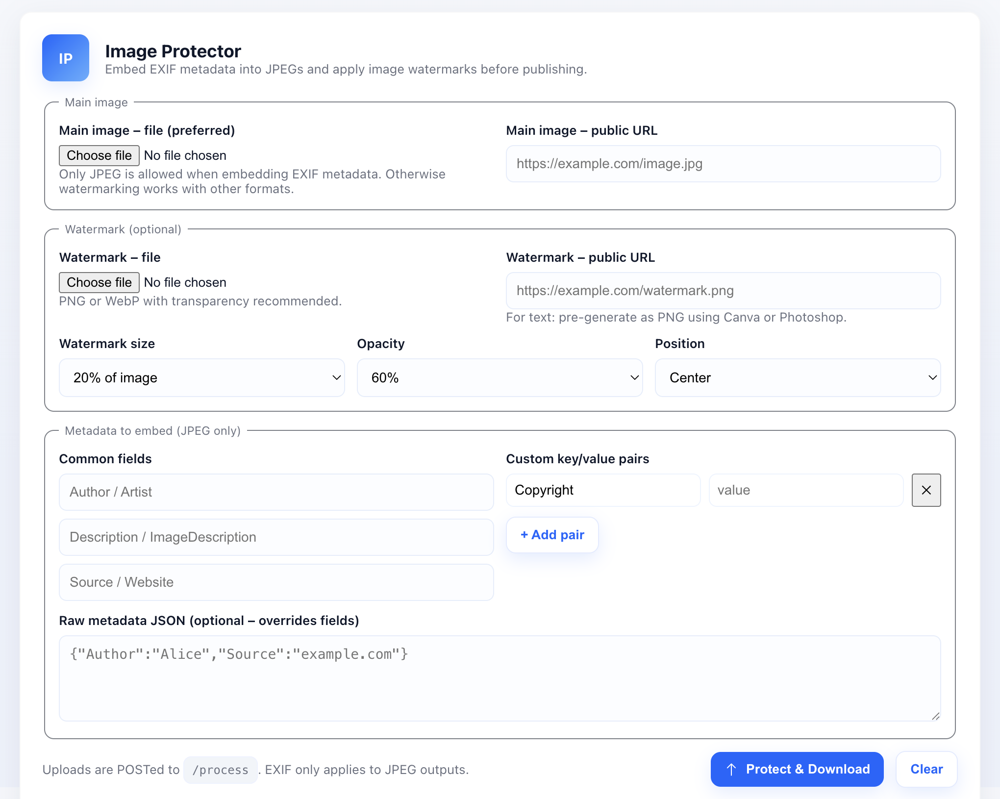

# Image Protector – Cloudflare Workers

Minimal image protection (watermarking) service built on Cloudflare Workers. Embeds EXIF metadata into JPEGs, applies watermarks, and compresses images using Cloudflare's [Image Transformations](https://developers.cloudflare.com/images/transform-images/transform-via-workers/).

## Features

### Core Capabilities

- **EXIF Metadata Embedding** – Adds copyright, author, and custom metadata to JPEG images
- **Image Watermarking** – Overlays watermarks with configurable size, opacity, and position
- **Smart Compression** – Quality control (1-100) and dimension constraints (width/height)
- **Adaptive Watermark Sizing** – Automatically scales watermark proportionally when resizing images

### Technical Features

- **Deterministic R2 Storage** – SHA-256 hashed keys for content-addressable storage
- **Metadata Preservation** – Uses `metadata=keep` parameter to preserve EXIF through transformations
- **Multiple Input Methods** – File upload or public URL for both main image and watermark
- **SSRF Protection** – Validates URLs and blocks private IP ranges
- **Format Verification** – Magic number validation for all image types
- **Zero Dependencies** – No third-party packages, pure Web Standards APIs

## Architecture

```
User Upload → Format Validation → EXIF Embedding (JPEG only)
    ↓
R2 Storage (SHA-256 key) → Cloudflare Image Transform
    ↓
Watermark Overlay + Compression → Download Protected Image
```

## Setup and Deployment

[](https://deploy.workers.cloudflare.com/?url=https://github.com/DavidJKTofan/cf-workers-exif-images)

## Screenshots



## API Usage

### Endpoint

`POST /process` – Process image with metadata and watermark

### Parameters (multipart/form-data)

#### Main Image (required, one of)

- `main_file` (File) – Upload image file
- `main_url` (string) – Public image URL

#### Watermark (optional, one of)

- `watermark_file` (File) – Upload watermark file
- `watermark_url` (string) – Public watermark URL

#### Metadata (optional, JPEG only)

- `metadata_json` (string) – JSON object with metadata
- Individual fields: `Author`, `Description`, `Source`, `Copyright`

#### Watermark Configuration

- `wm_size` (string) – Size as percentage (`20p`) or pixels (`150`).
- `wm_opacity` (string) – Opacity 0-100 or 0.0-1.0.
- `wm_gravity` (string) – Position: `center`, `northwest`, `northeast`, `southwest`, `southeast`, `north`, `south`, `east`, `west`.

#### Image Quality

- `quality` (number) – JPEG quality 1-100.
- `width` (number) – Max width in pixels. Optional
- `height` (number) – Max height in pixels. Optional

### Response

- **Success**: Image file (inline, with download filename)
- **Error**: JSON with `error` field

### Examples

#### Basic Watermark

```bash
curl -X POST https://exif.automatic-demo.com/process \
  -F "main_file=@image.jpg" \
  -F "watermark_url=https://example.com/logo.png" \
  -o protected.jpg
```

#### Full Configuration

```bash
curl -X POST https://exif.automatic-demo.com/process \
  -F "main_file=@photo.jpg" \
  -F "watermark_file=@logo.png" \
  -F "wm_size=15p" \
  -F "wm_opacity=70" \
  -F "wm_gravity=southeast" \
  -F "quality=80" \
  -F "width=1920" \
  -F "metadata_json={\"Author\":\"John Doe\",\"Copyright\":\"© 2025\"}" \
  -o protected.jpg
```

#### Compress Without Watermark

```bash
curl -X POST https://exif.automatic-demo.com/process \
  -F "main_file=@large.jpg" \
  -F "quality=70" \
  -F "width=1200" \
  -o compressed.jpg
```

#### PNG with Watermark (No EXIF)

```bash
curl -X POST https://exif.automatic-demo.com/process \
  -F "main_file=@image.png" \
  -F "watermark_url=https://example.com/logo.png" \
  -o protected.png
```

## Metadata Support

### JPEG (EXIF)

EXIF metadata support with the following standard tags:

- `ImageDescription` (0x010E)
- `Artist` (0x013B)
- `Copyright` (0x8298)

Custom metadata fields are JSON-encoded and appended to `ImageDescription`.

**Important**: EXIF metadata is **only** embedded in JPEG images. Other formats will process watermarks and compression but skip metadata embedding.

### PNG (tEXt chunks)

Metadata is attempted to be stored as PNG tEXt chunks. Suitable for PNG outputs when metadata is provided for non-JPEG inputs.

### SVG (metadata element)

Metadata embedded as `<metadata>` XML element.

## Watermark Adaptive Sizing

When applying dimension constraints (`width` or `height`), the watermark size automatically adapts:

**Example**:

- Original image: 2000×1500px
- Watermark size: 20% (`20p`)
- Max width: 800px

**Result**:

- Final image: 800×600px
- Watermark: 160px (20% of 800px)

This ensures watermarks remain proportional after resizing.

## Security

### SSRF Protection

- Blocks private IP ranges (10.0.0.0/8, 172.16.0.0/12, 192.168.0.0/16)
- Blocks localhost and link-local addresses
- Only HTTP/HTTPS protocols allowed

### Input Validation

- Magic number verification for all image formats
- File size limits (10MB default)
- Dimension validation (10,000px max)
- URL format validation

## Configuration

Edit `CONFIG` object in `src/index.ts`:

```typescript
const CONFIG = {
	MAX_FILE_SIZE: 10 * 1024 * 1024, // 10MB
	MAX_METADATA_SIZE: 10 * 1024, // 10KB
	MAX_DIMENSION: 10000, // 10,000px
	FETCH_TIMEOUT: 15000, // 15 seconds
	MAX_WM_RATIO: 0.25, // 25% max watermark size
};
```

## Best Practices

1. **Always use JPEG for metadata** – Other formats won't preserve EXIF
2. **Optimize watermarks** – Use PNG with transparency, pre-compress before upload
3. **Set quality appropriately** – 85 is optimal for most JPEGs
4. **Use percentage sizing** – Watermark sizes like `20p` scale better than fixed pixels
5. **Cache watermarks** – Upload once to R2, reuse URL across requests
6. **Monitor R2 usage** – Implement cleanup for old/unused images

## Disclaimer

This project is intended for educational and personal use. You are responsible for implementing appropriate security and operational measures for production deployments. Always audit and test before production rollout.

You are responsible for:

- Implementing proper authentication in production
- Compliance with copyright and privacy laws
- Rate limiting and abuse prevention
- Monitoring costs and usage
- Security audits and updates

**Note**: The demo domains may become unavailable. Deploy to your own Cloudflare Workers account for production use.
